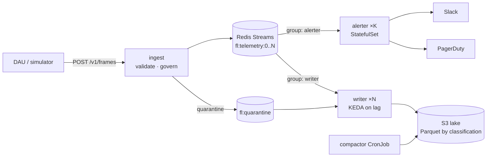

# Flight Telemetry Pipeline

> **Archived.** Its alerting
> engine (threshold rules with sustain windows, hysteresis, severity levels and
> per-incident dedup) now lives in
> [ticket-price-monitor](https://github.com/mattthomas7641/ticket-price-monitor)
> (`ticket_buzzer/alerting/`), where it decides when a resale ticket price is
> worth a push notification. On that project's recorded price history it cut
> alerts by 67–81% and noise alerts from 32 to 1. See that README's
> Results section.

> Python package and CLI: `flightline`

**A governed flight-test telemetry pipeline.** Ingests high-rate time-series from
aircraft data acquisition units, classifies and tags every sample *before* it lands,
stores it in a partitioned S3 data lake, and pages on-call the moment a reading
crosses a safety threshold, without the paging path ever waiting on storage.

Built around the shape of a real flight-test data platform: Python, AWS (S3, KMS, IAM,
EKS), data governance, ETL, Docker, Kubernetes-native autoscaling, and threshold-based
alerting with avionics-style rules.

```
           ┌────────────── governance at the door ─────────────┐
DAU ──HTTP─▶ ingest (FastAPI, HPA on CPU) ─ validate · classify · tag · lineage
                                │                       └─▶ quarantine (unregistered / skewed / malformed)
                                ▼
                 Redis Streams, sharded by aircraft (ordered per aircraft)
                     │ consumer group "writer"          │ consumer group "alerter"
                     ▼                                  ▼
   writer ×N (Deployment, KEDA on lag)     alerter ×K (StatefulSet, shard-owned)
   Parquet, partitioned by classification   event-time rules: sustain + hysteresis
                     │                                  │
                     ▼                                  ▼
   S3 (SSE-KMS, tag-driven retention,      PagerDuty Events v2 (dedup_key) · Slack
       IAM scoped by classification)        + audit stream
                     │
   compactor (CronJob): small files → one deduplicated file per partition-hour
```



## What makes it trustworthy

| Concern | How it is handled |
|---|---|
| **Nothing lands untagged** | Every sample gets classification, owner, retention class, unit and lineage (`ingest_id`, `catalog_version` hash, `pipeline_version`) at ingest. Unknown channels quarantine the whole frame. An S3 bucket policy *denies* any PUT without a `classification` tag, so the invariant holds even against a buggy writer. |
| **Access follows classification** | Classification is the top-level S3 prefix. IAM grants `internal`/`proprietary` to analysts and requires `aws:PrincipalTag/export_cleared=true` for `export_controlled` and the quarantine. |
| **Retention is enforced by S3, not a script** | Writers tag objects with `retention_class` atomically at PUT; lifecycle rules expire them (30 d / 1 y / 7 y). |
| **Pages are fast even when storage is not** | Writer and alerter are separate consumer groups. Measured: **166 ms mean ingest→page** while the writer's p99 ingest→durable was 30 s under saturation. |
| **Pages are right** | Rules fire on *event time* with a sustain window (filters spikes) and hysteresis (no flapping). Escalation warn→critical and resolve reuse one PagerDuty `dedup_key`. Sensor faults (physically impossible values) are stored but never paged. |
| **A silent pipeline pages too** | Telemetry-loss watchdog: an active flight that goes quiet for 5 s is a critical page. |
| **No data loss on crash** | At-least-once: entries are acked only after a durable write / dispatched page. Restarted pods replay their own pending entries; survivors `XAUTOCLAIM` a dead pod's. Flush keys are deterministic, so retries overwrite rather than duplicate. |
| **Duplicates are removed** | Hourly compaction deduplicates on the natural key `(source_id, seq, channel)` and merges small files. It is idempotent and crash-safe without coordination. |
| **One bad message cannot stop paging** | Undecodable entries go to a dead-letter stream and are acked. (This was found the hard way; see [Benchmarks](docs/BENCHMARKS.md#incident-poison-message-crash-loop).) |
| **Bursts don't fall behind** | Ingest scales on CPU (HPA); writers scale on stream lag (KEDA, one trigger per shard); ingest sheds load with `503 + Retry-After` before Redis can grow unbounded. |

## Numbers

Measured on a laptop (Docker Desktop, 8 vCPU VM shared by the whole stack). Method and
caveats are in [docs/BENCHMARKS.md](docs/BENCHMARKS.md).

| | |
|---|---|
| Ingest, single pod / single core | **11k frames/s (420k samples/s)**, p50 30 ms, p99 121 ms per 200-frame batch |
| Alerter, single core | **46k frames/s (1.75M samples/s)**, 5.4× after profiling |
| Ingest → page under storage saturation | **166 ms mean, p99 < 250 ms** |
| Stream entry size | **15× smaller** after per-entry dictionary encoding + zlib-1 |
| Tests | 96 unit/integration + 1 end-to-end, **93% branch coverage**, `mypy --strict` |

## Quick start

```bash
make install        # venv + dev deps
make test           # 96 tests, coverage gate 85%
make up             # ingest, 2 writers, alerter, Redis, S3 (LocalStack), pager mock, Prometheus, Grafana
make demo           # fly 3 aircraft; motor 7 on N301FL overheats mid-cruise
```

Then watch:

- **Pages**: http://localhost:8090/incidents (a PagerDuty Events v2 stand-in with real dedup semantics)
- **Dashboard**: http://localhost:3000 (Grafana, provisioned)
- **Lake**: `docker compose exec s3 awslocal s3 ls s3://flightline-telemetry --recursive | head`

Other scenarios: `flightline simulate --scenario {nominal,motor-overtemp,sensor-fault,dropout,rogue-channel}`.

```bash
make e2e            # automated end-to-end against the running stack
make bench          # ingest load test from inside the compose network
make check          # lint + mypy + tests + kubeconform on rendered manifests
make tf-validate    # terraform fmt/validate
```

### On Kubernetes

`deploy/k8s` is Kustomize: a `base`, a `local` overlay (adds in-cluster Redis,
LocalStack and the pager mock) and an `aws` overlay (IRSA, ElastiCache TLS, External
Secrets, KEDA). Verified by deploying the local overlay to k3s and flying aircraft
through it.

```bash
make k8s-local      # against any cluster with the flightline:dev image loaded
```

## Repository map

```
config/            catalog.yaml (governance policy) · rules.yaml (safety thresholds)
src/flightline/
  ingest/app.py    FastAPI: validate → govern → enqueue, backpressure, auth
  governance.py    catalog, tagger, lineage, quarantine
  streams.py       sharded Redis Streams bus, entry codec, reclaim, dead-letter
  writer/          lake writer (Parquet), S3/local sinks, compaction
  alerting/        rules, event-time engine, notifiers, shard-owning worker
  simulator.py     12-rotor eVTOL flight profile + failure scenarios
deploy/k8s/        Kustomize base, overlays/{local,aws}, components/keda
deploy/terraform/  S3 lake, KMS, lifecycle, bucket policy, IRSA + ABAC IAM
ops/               Prometheus scrape + pipeline alerts, Grafana dashboard
docs/              DESIGN.md · RUNBOOK.md · BENCHMARKS.md
```

## Design

Read [docs/DESIGN.md](docs/DESIGN.md) for the decisions, alternatives considered
(Kafka/Kinesis, Flink, per-channel quarantine, wall-clock rules) and failure analysis.
